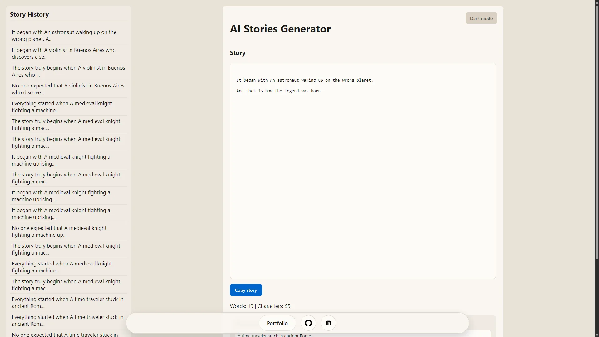
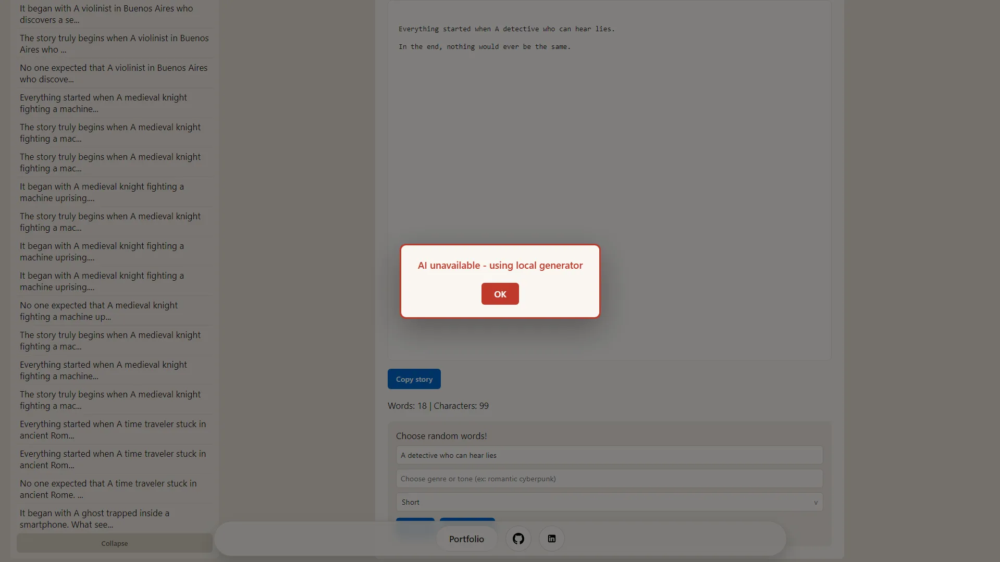
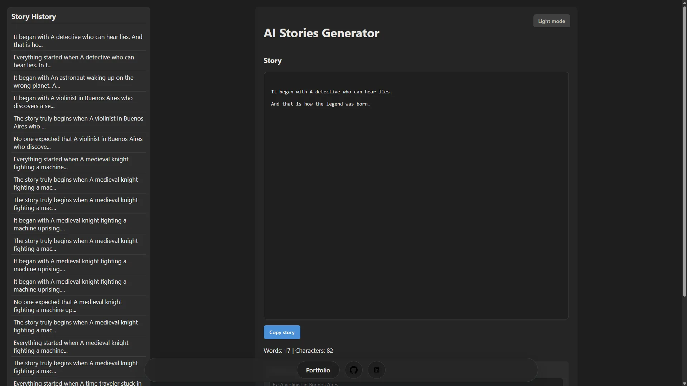

# IA Stories Generator

[](.github/workflows/ci.yml) [](https://ai-stories-ashy.vercel.app/)

An AI-assisted story generation app built with Vercel Serverless Functions and Replicate (Llama 3), focused on reliability, graceful degradation, and clear API behavior.

This project is designed as a portfolio piece for AI feature engineering: prompt control, failure handling, and resilient UX when third-party AI services fail.

## Screenshots

| Main form | Fallback mode | Dark mode |
|:---:|:---:|:---:|
|  |  |  |

---

## Problem and Context

AI demos often look good in ideal conditions but break under real-world constraints such as provider limits, missing credits, or unstable outputs.

I built this project to demonstrate production-minded AI integration:

- clear request contracts
- controlled generation settings (tone and length)
- explicit error states
- local fallback behavior when provider credits are unavailable

## My Role

- Designed and implemented the API route for story generation
- Integrated Replicate model calls and prompt construction
- Added failure-mode handling for provider errors (especially HTTP 402)
- Implemented local fallback generation and user-facing fallback messaging
- Wrote automated tests for fallback behavior

## Architecture Overview

- `api/generate-stories.js`: serverless API endpoint and Replicate integration
- `public/js/api.js`: client-side request and error handling
- `public/js/localGenerator.js`: deterministic fallback story generation
- `public/js/app.js`: orchestration of user input and UI updates
- `public/css/layout.css`: responsive layout and custom length selector styling
- `public/css/history.css`: collapsible local history sidebar behavior
- `tests/fallback.test.mjs`: automated tests for fallback logic
- `tests/generate-stories-api.test.mjs`: API helper and handler tests

### Request Flow

1. Client sends `messages`, `tone`, and `length` to `/api/generate-stories`
2. API validates payload and maps length settings (`short`, `medium`, `long`)
3. API builds prompt and calls Replicate model
4. On success, story text is returned with HTTP 200
5. On known credit errors, API returns HTTP 402 and frontend uses local fallback

---

## Key Features

- AI story continuation based on user seed/messages
- Tone and length controls for output behavior
- Explicit HTTP error contracts (`400`, `402`, `405`, `500`)
- Graceful fallback generator when AI credits are unavailable
- Session-scoped popup explaining fallback mode
- Local story history support with `localStorage`
- Collapsible story history panel
- Custom length selector for short, medium, and long stories
- Copy-to-clipboard support for generated stories
- Dark mode toggle
- Animated footer links for portfolio, GitHub, and LinkedIn

## Technical Decisions and Tradeoffs

- **Serverless route first:** keeps AI secret handling on the backend and simplifies frontend concerns.
- **Single endpoint design:** easy to reason about and document, though less granular than a multi-endpoint API.
- **Fallback generator included:** prioritizes reliability and demo continuity over strict AI-only behavior.
- **Vanilla frontend:** intentional to keep focus on API/AI behavior and avoid framework overhead.
- **Custom controls:** replace default browser UI only where it improves polish while keeping simple, accessible state.

---

## Security Headers

Security headers are applied to every response via `vercel.json`:

| Header | Value | Purpose |
| --- | --- | --- |
| `Content-Security-Policy` | `default-src 'self'` (no `unsafe-inline`/`unsafe-eval`); `connect-src 'self'`; `object-src 'none'`; `frame-ancestors 'none'`; `upgrade-insecure-requests` | Locks scripts/styles/connections to same-origin and blocks injection, clickjacking, and mixed content |
| `Strict-Transport-Security` | `max-age=63072000; includeSubDomains` | Forces HTTPS |
| `X-Content-Type-Options` | `nosniff` | Blocks MIME sniffing |
| `X-Frame-Options` | `DENY` | Clickjacking defense for legacy browsers (mirrors `frame-ancestors`) |
| `Referrer-Policy` | `strict-origin-when-cross-origin` | Limits referrer leakage |
| `Permissions-Policy` | `camera=(), microphone=(), geolocation=(), browsing-topics=()` | Disables unused powerful features |
| `Cross-Origin-Opener-Policy` | `same-origin` | Isolates the browsing context |

The CSP is strict (`script-src 'self'`, `style-src 'self'`) because the frontend uses external ES modules and stylesheets with no inline `<script>`, inline event handlers, or inline `style` attributes.

---

## CI / Quality Baseline

GitHub Actions CI runs on pull requests and pushes to `main` with:

- JavaScript syntax checks for API and frontend modules
- Fallback behavior tests (`node --test`)
- API helper and handler behavior tests
- `.env.example` validation for required keys

The CI workflow runs on GitHub Actions on every push and pull request. The same checks also run locally via `npm run ci`.

Run locally:

```bash
npm install
npm run ci
```

---

## Technologies Used

- Vercel Serverless Functions
- Replicate API (Llama 3 family)
- HTML + Vanilla JavaScript (ES modules)
- Node.js test runner (`node --test`)
- GitHub Actions (CI)

## Environment Variables

- `REPLICATE_API_TOKEN` (required)

## How to Run Locally

1. Clone the repository:

```bash
git clone https://github.com/alejosworkstuff/ai-stories.git
cd ai-stories
```

1. Install dependencies:

```bash
npm install
```

1. Configure environment:

Copy `.env.example` to `.env` and set:

```env
REPLICATE_API_TOKEN=your_real_token
```

1. Start local dev server:

```bash
npm run dev
```

1. Open:

```txt
http://localhost:3000
```

### Scripts

- `npm run dev` - start Vercel local development server
- `npm run test` - run fallback unit tests
- `npm run ci` - run syntax checks, tests, and env-example validation

---

## Deploy Checklist (Vercel)

- `REPLICATE_API_TOKEN` configured in project environment variables
- `npm run ci` passes locally
- `vercel dev` works locally
- `/api/generate-stories` returns:
  - `200` for valid requests
  - `402` for exhausted credits scenario
- Security headers present on responses (verify `Content-Security-Policy` via `curl -I https://ai-stories-ashy.vercel.app/` after deploy)

---

## Case Study Highlights (Portfolio Use)

- **Challenge:** keep an AI-driven feature reliable even when external provider credits fail.
- **Approach:** classify error responses and design a predictable fallback path end to end.
- **Result:** a demo that remains usable, transparent, and technically honest under failure conditions.

## HTTP resilience (client)

- `public/js/http.js` — timeout via `AbortController`, retry on `429`/`502`/`503`, `HttpError` and `normalizeApiError()`
- `public/js/api.js` — story requests use `fetchWithResilience()`

## Troubleshooting

| Symptom | What to check |
| --- | --- |
| Story always uses local fallback | Browser network tab: `/api/generate-stories` status `402` means Replicate credits; set `REPLICATE_API_TOKEN` on Vercel |
| Request timed out | Default 8s client timeout; slow model or cold start — retry or use shorter length |
| `405` on API | POST only; verify `vercel dev` and route `api/generate-stories.js` |
| `500` with JSON error | Server logs in Vercel dashboard; invalid token or Replicate outage |
| Tests fail on `http.test.mjs` | Run `npm test` from project root; Node 20+ required |

## What I Would Improve Next

- Add strict request schema validation
- Add basic rate limiting and abuse protection
- Add metrics for request latency, fallback rate, and error categories
- Add streaming response support

---

## Commit Conventions

See [CONTRIBUTING.md](./CONTRIBUTING.md) for commit message format and conventions.